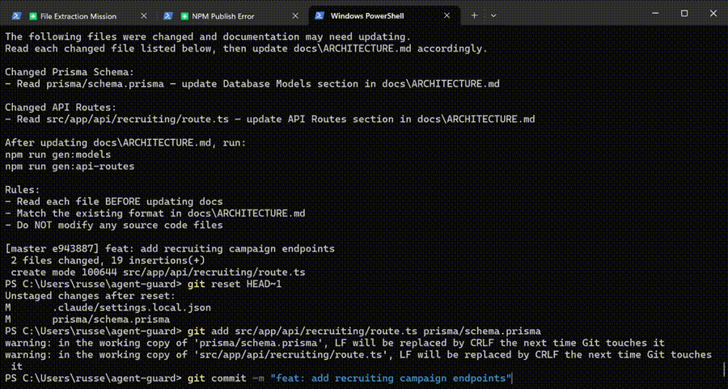

# agent-guard

[](LICENSE)
[](https://nodejs.org)
[](CONTRIBUTING.md)

<p align="center">
  
</p>

---

## The Problem: Context Rot

Every codebase tells two stories: the code itself, and the documentation that explains it. Over time, these stories diverge. A developer adds a new API route but forgets to update the docs. Another renames an environment variable but doesn't touch the README. A third refactors the database schema while the architecture doc still references the old model names.

This is **Context Rot** — the slow decay of documentation accuracy that plagues every long-lived project.

The symptoms are familiar:
- New team members onboard with outdated information
- AI coding assistants hallucinate based on stale context
- Architecture decisions get lost to tribal knowledge
- "The code is the documentation" becomes the reluctant mantra

**agent-guard** solves Context Rot with a four-layer defense system that keeps your documentation perpetually synchronized with your code.

---

## How It Works: Four Layers of Defense

```
┌─────────────────────────────────────────────────────────────────────┐
│                         YOUR CODEBASE                               │
├─────────────────────────────────────────────────────────────────────┤
│                                                                     │
│  ┌───────────────────────────────────────────────────────────────┐  │
│  │  LAYER 1: Standing Instructions                               │  │
│  │  ─────────────────────────────────────────────────────────── │  │
│  │  AI agents receive real-time context about your docs.         │  │
│  │  When they modify code, they update documentation inline.     │  │
│  └───────────────────────────────────────────────────────────────┘  │
│                              │                                      │
│                              ▼                                      │
│  ┌───────────────────────────────────────────────────────────────┐  │
│  │  LAYER 2: Generated Inventories                               │  │
│  │  ─────────────────────────────────────────────────────────── │  │
│  │  Deterministic scripts extract truth from code:               │  │
│  │  • API routes → docs/_generated/api-routes.md                 │  │
│  │  • Prisma models → docs/_generated/prisma-models.md           │  │
│  │  • Env vars → docs/_generated/env-vars.md                     │  │
│  └───────────────────────────────────────────────────────────────┘  │
│                              │                                      │
│                              ▼                                      │
│  ┌───────────────────────────────────────────────────────────────┐  │
│  │  LAYER 3: Pre-commit Hook                                     │  │
│  │  ─────────────────────────────────────────────────────────── │  │
│  │  Catches drift before it reaches the repo:                    │  │
│  │  • Detects doc-relevant code changes                          │  │
│  │  • Auto-fixes docs or generates remediation prompts           │  │
│  │  • Never blocks commits — always exits cleanly                │  │
│  └───────────────────────────────────────────────────────────────┘  │
│                              │                                      │
│                              ▼                                      │
│  ┌───────────────────────────────────────────────────────────────┐  │
│  │  LAYER 4: CI/CD Audits                                        │  │
│  │  ─────────────────────────────────────────────────────────── │  │
│  │  Final safety net in your pipeline:                           │  │
│  │  • GitHub Actions catch drift on every push                   │  │
│  │  • Weekly scheduled health checks                             │  │
│  │  • PR comments with specific remediation steps                │  │
│  └───────────────────────────────────────────────────────────────┘  │
│                                                                     │
└─────────────────────────────────────────────────────────────────────┘
```

---

## Quick Start

```bash
# Install agent-guard as a dev dependency
npm install --save-dev @mossrussell/agent-guard

# Initialize agent-guard in your project
npx agent-guard init

# Run full documentation sync (generators + AI narrative)
npx agent-guard sync

# Set up git hooks
npm run prepare
```

---

## Auto-Fix Mode

When you commit, the pre-commit hook automatically:

1. **Runs inventory generators** — regenerates `docs/_generated/*.md` files and stages them
2. **Updates narrative docs** — uses your configured engine to update `ARCHITECTURE.md` and `README.md` based on your changes
3. **Falls back gracefully** — if no engine is available, it prints a copy-paste prompt instead

The hook **never blocks commits** — it always exits 0 so your workflow is never interrupted.

### Engine Options

| Engine | Speed | Cost | Requirements |
|--------|-------|------|--------------|
| **API Engine** (Recommended) | ~12 seconds | ~$0.13/commit | `ANTHROPIC_API_KEY` in `.env` |
| **Claude Code Engine** | ~30-60 seconds | Free (uses your session) | Claude Code CLI installed |

**API Engine** — Calls the Anthropic API directly. Fast, cross-platform, and reliable. Set `"engine": "api"` in config.

**Claude Code Engine** — Spawns Claude Code as a subprocess. Free if you have an active Claude Code session, but slower and requires the CLI installed.

### When auto-fix succeeds:

```
✓ Doc-relevant changes detected — docs also updated. Nice!

[main abc1234] feat: add user endpoint
 4 files changed, 52 insertions(+)
```

### When no engine is available (prompt mode):

```
⚠️  Documentation may need updating
━━━━━━━━━━━━━━━━━━━━━━━━━━━━━━━━━━

Changed:
  📡  API Routes (1 file):
     - src/app/api/users/route.ts

┌─────────────────────────────────────────────┐
│  Claude Code Prompt (copy-paste this):       │
└─────────────────────────────────────────────┘

The following files were changed and documentation may need updating...
```

---

## API Engine Setup

To use the faster API engine:

1. **Add your API key** to `.env`:
   ```
   ANTHROPIC_API_KEY=sk-ant-...
   ```

2. **Set engine to "api"** in `agent-docs.config.json`:
   ```json
   "autoFix": {
     "narrative": {
       "enabled": true,
       "engine": "api"
     }
   }
   ```

3. **That's it** — next commit or `npx agent-guard sync` will use the API.

**Cost estimate:** ~$0.13/commit, ~$0.29/sync, ~$12-15/month with active use. Zero new dependencies (uses Node 20+ native fetch).

---

## Commands

| Command | Description |
|---------|-------------|
| `agent-guard init` | Interactive setup wizard. Creates config, scripts, hooks, and workflows. |
| `agent-guard init --yes` | Non-interactive setup with defaults. Use `--project-name`, `--prisma`, `--agent-config` flags. |
| `agent-guard init --force` | Overwrite existing template scripts (for upgrades). |
| `agent-guard detect` | Auto-detect baselines (file counts, TODOs, etc.) and update config. |
| `agent-guard gen` | Run all inventory generators (`gen:api-routes`, `gen:env`, `gen:models`). |
| `agent-guard check` | Run the pre-commit documentation check manually. |
| `agent-guard sync` | Full documentation pass: runs generators + AI narrative updates. |

All commands support `-v, --verbose` for detailed output and `-c, --config <path>` to specify a custom config file.

---

## Configuration

agent-guard is configured via `agent-docs.config.json`:

```json
{
  "projectName": "My Project",
  "architectureFile": "docs/ARCHITECTURE.md",
  "agentConfigFile": ".cursorrules",
  "additionalAgentConfigs": ["CLAUDE.md"],
  "autoFix": {
    "generators": true,
    "narrative": {
      "enabled": true,
      "engine": "api",
      "model": "claude-sonnet-4-20250514",
      "apiKeyEnv": "ANTHROPIC_API_KEY",
      "maxTokens": 32000,
      "review": false,
      "narrativeTriggers": ["api-routes", "prisma", "env"],
      "additionalNarrativeTargets": ["README.md"]
    }
  },
  "scanPaths": {
    "apiRoutes": "src/app/api/",
    "prismaSchema": "prisma/schema.prisma",
    "envFile": ".env.example"
  }
}
```

### Key configuration fields:

| Field | Description |
|-------|-------------|
| `projectName` | Your project name, used in generated docs. |
| `architectureFile` | Path to your main architecture doc (default: `docs/ARCHITECTURE.md`). |
| `agentConfigFile` | Primary AI agent config file (`.cursorrules`, `CLAUDE.md`, etc.). |
| `additionalAgentConfigs` | Extra agent config files to write standing instructions to. |
| `autoFix.generators` | Auto-run inventory generators at commit time (default: `true`). |
| `autoFix.narrative.enabled` | Enable AI narrative updates (default: `true`). |
| `autoFix.narrative.engine` | `"api"` (direct API) or `"claude-code"` (subprocess). Default: `"claude-code"`. |
| `autoFix.narrative.model` | Anthropic model ID. Default: `"claude-sonnet-4-20250514"`. Only used with API engine. |
| `autoFix.narrative.apiKeyEnv` | Env var name for API key. Default: `"ANTHROPIC_API_KEY"`. Only used with API engine. |
| `autoFix.narrative.maxTokens` | Max response tokens. Default: `32000`. Only used with API engine. |
| `autoFix.narrative.review` | Show diff and confirm before staging AI changes (default: `false`). |
| `autoFix.narrative.narrativeTriggers` | Category IDs that trigger narrative updates. |
| `autoFix.narrative.additionalNarrativeTargets` | Extra files for AI to update beyond `architectureFile`. |
| `scanPaths` | Paths to scan for API routes, Prisma schema, env file, etc. |

---

## Documentation Structure

```
docs/
├── ARCHITECTURE.md          # Human-maintained architecture overview
└── _generated/              # Auto-generated inventories (do not edit)
    ├── api-routes.md        # Extracted from src/app/api/**
    ├── prisma-models.md     # Extracted from prisma/schema.prisma
    └── env-vars.md          # Extracted from .env.example
```

---

## How the Layers Work Together

| Layer | Trigger | Action |
|-------|---------|--------|
| **Standing Instructions** | AI agent session | Updates docs alongside code changes |
| **Generated Inventories** | `npm run gen:all` or auto at commit | Regenerates markdown from source files |
| **Pre-commit Hook** | `git commit` | Auto-runs generators + AI narrative updates; falls back to prompt if unavailable |
| **CI/CD Audits** | Push / PR / Schedule | Creates issues if drift detected; quality-checks AI-generated docs |

---

## Upgrading

To upgrade agent-guard and get the latest template scripts:

```bash
npm install --save-dev @mossrussell/agent-guard@latest
npx agent-guard init --force
```

The `--force` flag overwrites existing template scripts with the latest versions while preserving your `agent-docs.config.json` settings.

---

## License

MIT
